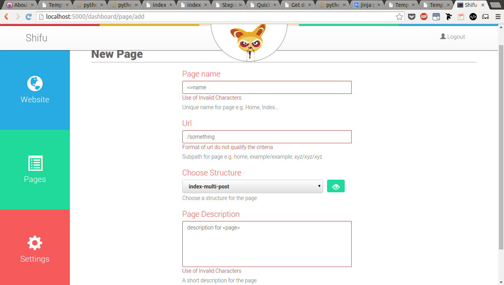
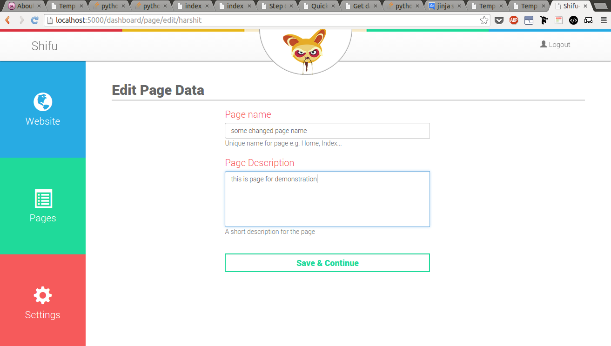

# SHIFU
####python-mongodb cms

The project is aimed at developing a simple easy to use **_content management system_** using **python-mongodb** collaboration.

## Installation
The project is developed on Ubuntu. The following instructions Ubuntu specific. For installation on other platforms, please use official guides for installion of required components.  

### Development and Testing Enviornment Setup:

1. Install virtualenv:
 ```
 install virtualenv
 pip install virtualenv
 ```
 or follow [this](http://docs.python-guide.org/en/latest/dev/virtualenvs/) for installing virtualenv.

 If you do not have pip installed:
 ```
 sudo apt-get install python-pip
 ```

2. Clone the repository on local machine:
 ```
 git clone https://github.com/GautamAnghore/shifu
 ```

 
3. cd into the project directory:
 ```
 cd shifu
 ```

4. Create a new virtual enviornment with python version 2.7:
 ``` 
 virtualenv -p /usr/bin/python2.7 venv
 ```

5. Activate the virtual enviornment:
 ```
 source venv/bin/activate
 ```

6. Install the requirements:
 ```
 pip install -r requirements.txt
 ```

7. Install MongoDB using the [official guide](http://docs.mongodb.org/manual/tutorial/#getting-started)(the development was done on mongodb v2.4.9).

### Running the Development Server:

 + First start the mongod server on port 27017 (default),
  ```
  sudo service mongodb start
  ```

 + Now, from the project root directory, start the development server
  ```
  python shifu/run.py
  ```

 Visit http://127.0.0.1:5000/ and you will see the project running.

## Screenshots:


|||
|-------------------------------------|-------------------------------------------|
|||
|||

## Contributors :
 
 + [Gautam Anghore](https://github.com/GautamAnghore)
 + [Harshit Thukral](https://github.com/Harshit369)

#### Contributors and Suggestions are always welcome
